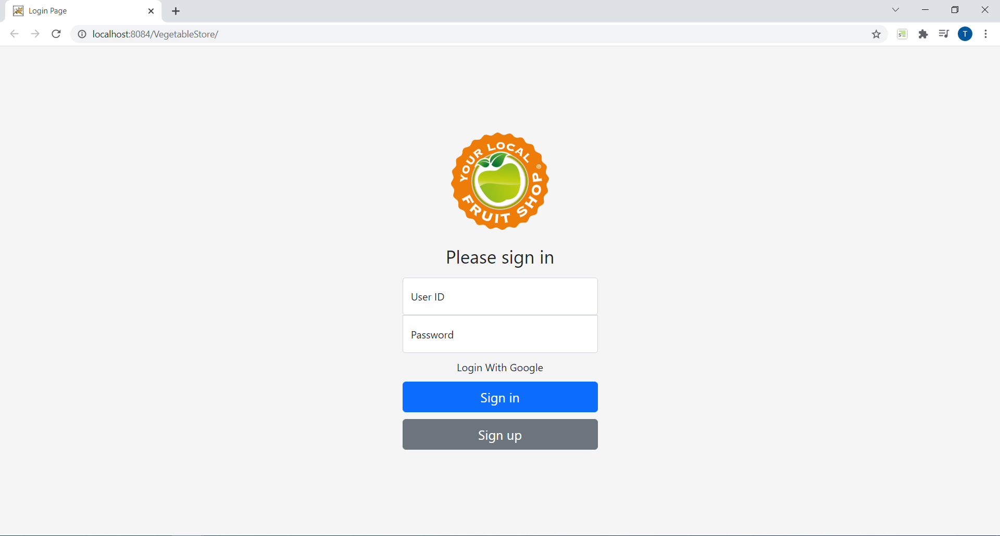
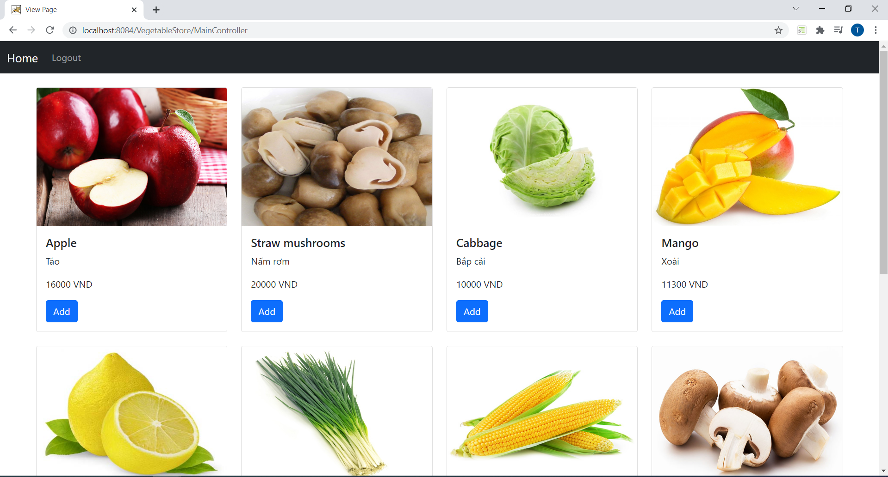
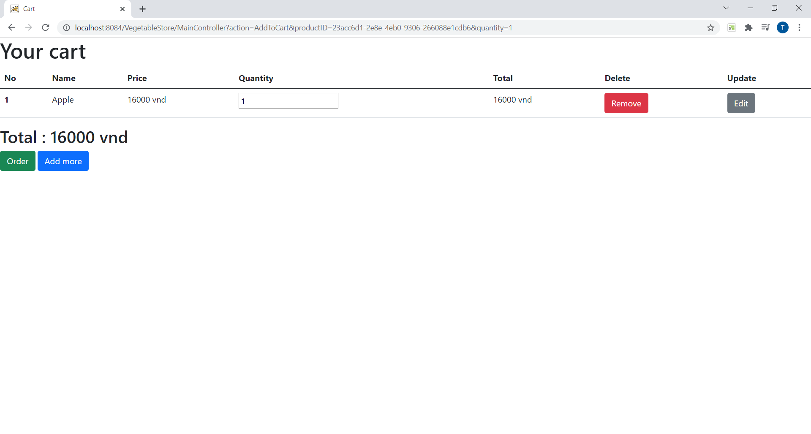
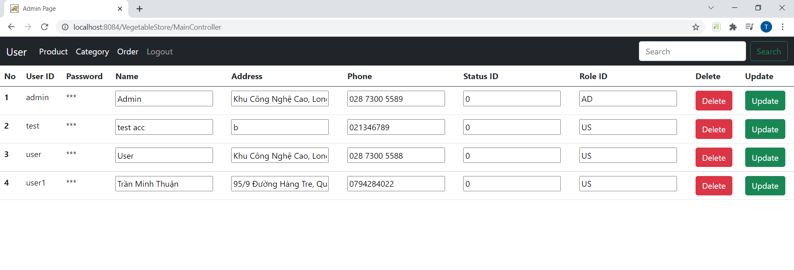
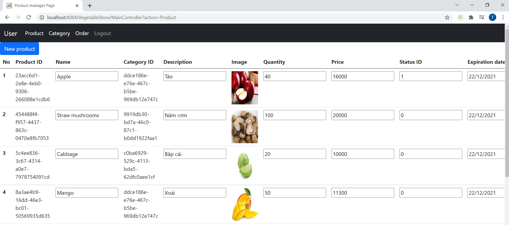
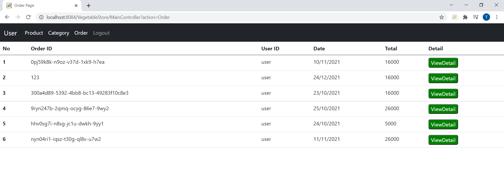

# JavaWebStore - Vegatable Store
## Case Study
Java Web Application - School Project
This is a website to sell vegetable related items during the covid-19 service

## Feature by role

- ### Both Role Action
     - Login, register new account and logout
- ### Customer Role Action
     - Add, delete and update item to cart
     - Create order
- ### Admin Role Action
     - Create, update and disable product
     - Create, update and disable category
     - View, and manage information products
     - Check order details for all customer

## Technology

- Frontend
     - JSP - Server Side Rendering
     - Bootstrap - Style
- Backend
     - Servlet
     - MVC architecture
     - SQL Server 2019 - Database

## Team Member (Self project)
- Trần Minh Thuận:
     - Gmail: minhthuan1912001@gmail.com
     - Linkedin: https://www.linkedin.com/in/tranminhthuan19
     - Github: https://github.com/TranMinhThuanFPTU

## Project Picture

### Login Page

### Home Page

### Cart Page

### User Page

### Product Page

### Order Page

